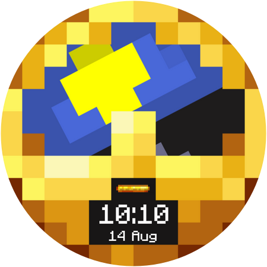
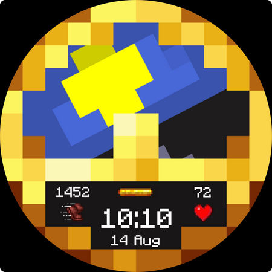

# Minecraft Watch Face
A Minecraft inspired Watchface for all WearOS Powered Smartwatches.

### Features
- Functional Clock Background
- Brewing Stand Battery Meter
- Animated Heart Rate symbol
- AOD Display
- Multiple Styles to choose from

### Installation
Open the .wfs file to [Watch Face Studio](https://developer.samsung.com/watch-face-studio/download.html) and try the Watchface out for yourself.   
You should enable 'Wireless Debugging' in the Developer settings of your Watch first. [How to enable developer settings.](https://developer.android.com/training/wearables/get-started/debugging) Pair your watch with Watch Face Studio, using 'Run on Device'.
If you have done all that, the watchface should be installed on your Watch.

Inside Watch Face Studio, you can also customize the Watchface to your own preferences.

### Issues
If the Watchface does not work on your device, or is rendered wrong, please open an Issue or make a pull request.

### Screenshots

#### Standard Clock

#### Advanced Clock     

#### Faithful Clock

### Contributing
You are welcome to contribute to this project. Please make sure that your changes improve the functionality, and do not take away features.
Please state all changes you've made to the watchface in the pull request.

All Images used in the watchface are separately stored inside the resources folder as .png files.
The .pdn filetype can be opened in the [paint.NET](https://www.getpaint.net/) software.

### Disclaimer
This watch face is provided for personal use only and is not intended for commercial purposes. 
I do not claim ownership or any intellectual property rights over the design or its elements. 
All rights remain with their respective owners, including, but not limited to, Mojang Studios.
Special thanks to Nighthater for improving the original design.
