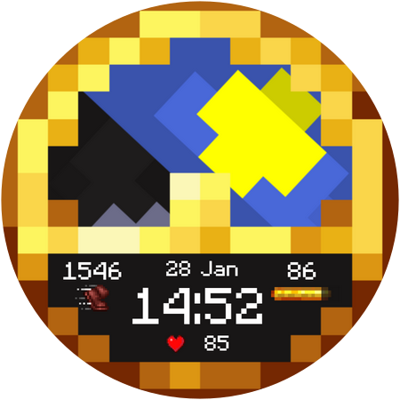

# Minecraft Watch Face

### Features
- Functional Clock Background
- Brewing Stand Battery Meter
- Animated Heart Rate symbol
- AOD Display

### Installation
Open the .wfs file to [Watch Face Studio](https://developer.samsung.com/watch-face-studio/download.html) and try the Watchface out for yourself.   
You should enable 'Wireless Debugging' inside your Watch first and pair your watch with Watch Face Studio.

Feel free to customize the Face to your own preferences.

 ### Normal Face     

### Standard Face

### Minimalist Face

### Disclaimer
This watch face is provided for personal use only and is not intended for commercial purposes. 
I do not claim ownership or any intellectual property rights over the design or its elements. 
All rights remain with their respective owners, including, but not limited to, Mojang Studios.
Special thanks to Nighthater for improving the original design.
